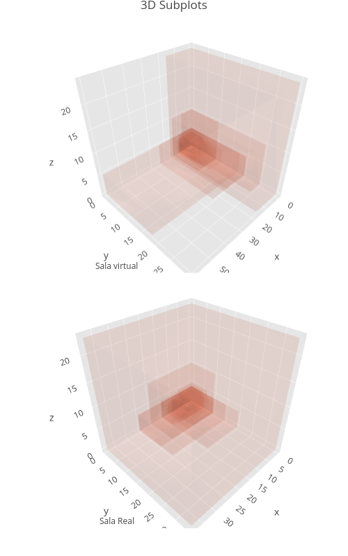

```{r setup, include=FALSE}
knitr::opts_chunk$set(echo = TRUE)
```

```{r dependencies,  include=FALSE}
# Dependencias ------------------------------------------------------------
library(broom)
library(broom.mixed)
library(dplyr)
library(ggbeeswarm)
library(gmodels)
library(ggplot2)
library(ggthemes)
library(ggpubr)
library(ggstatsplot)
library(htmlwidgets)
library(quickpsy)
library(tidyverse)
library(lme4)
library(nlme)
library(lmerTest)
library(modelr)
library(pracma)
library(plotly)
library(Routliers)
library(processx)
library(orca)
```

## Introducción

La motivación de este experimento consiste en probar lo aseverado en Calcagno et al. que sugiere que la modalidad visual tiene una influencia en la percepeción auditiva de distancia. 

H1: El tamaño de sala afecta la percepción auditiva de distancia.

H2: El tamaño máximo de sala percibido visualmente se correlaciona positivamente con la mayor distancia reportada para la percepción auditiva de distancia.
 
## Materiales y métodos

Para probar estas hipótesis se realizó un setup experimental mixto. En este coexisten entornos virtuales visuales (mediante un casco de realidad virtual) y fuentes reales ubicadas en el mismo entorno acústico (sala del Lapso).

El uso del casco de realidad virtual consiste de una aplicación en UE 5.0 que permite situar al sujeto en entornos virtuales para realizar una manipulación experimental en la modalidad visual. Esta manipulación consiste de dos condiciones. Por un lado, una sala virtual equivalente en tamaño y aspecto a la sala real en la cual el participante realiza la tarea. Por otro lado, una sala que es la mitad en tamaño de profundidad, esto es, la pared situada en frente del participante.

En lo que respecta a la parte auditiva, se utilizó una configuración de parlantes clásicas para relevar curvas de distancia. Esta configuración consiste en situar parlantes a distintas distancias en el plano frontal del sujeto a lo largo del eje anetoro posterior. Las distancias utilizadas fueron: 2 m, 2.7 m, 3.65 m, 4.9 m, 6.65 m y 9 m. De los parlantes se emite un estimulo sonoro, un burst de ruido blanco de duración de 500 ms. El estímulo se emite con intensidad equivalente desde los distintos parlantes para inducir el cue o pista mas significativo del la percepción auditiva de distancia que es la variación de la intensidad del estímulo en función de la distancia.

Para realizar el experimento, los participantes fueron divididos en dos grupos. A cada grupo se lo exponía a un entorno virtual diferente. Un grupo veía en primer instancia en el entorno virtual una sala congruente con la sala real en la que se encontraba. El otro grupo, era expuesto a una sala de mitad del tamaño en profundidad.
Los participantes fueron introducidos en la sala experimental con los ojos vendados para que no conocieran el entorno real de forma visual. Una vez dentro de la sala experimental, se sentaban en una silla y se les colocaba el casco de realidad virtual procurando que no vieran la sala real. Con el casco ya colocado se les mostraba una sala virtual congruente o no congruente, dependiendo del grupo al que pertenecieran. Luego de exponer a los participantes al entorno virtual durante unos instantes, se apagaba el estímulo visual y debían dar un reporte verbal a ciegas de la distancia a la cual percibiían estímulos sonoros. En un segundo bloque, se les mostraba la sala que no habían visto previamente, y luego realizaban la misma tarea de reporte verbal de localización de estiímulos sonoros. 

Este diseño fue motivado para poder observar la existencia de un efecto tanto entre sujetos como intra sujetos.

## Participantes

Del experimento participaron 50 sujetos. *SACAR DATOS POBLACIONALES*
      
## Análisis de datos

```{r load_data, include=FALSE}

tabla.raw <- read.csv('./data/data-1-50-bloque-1-sin-outliers.csv', header = TRUE, sep = ' ', stringsAsFactors = TRUE)

tabla.raw$SesgoAbs <-  tabla.raw$respuesta - tabla.raw$distancia
tabla.raw$SesgoRel <- (tabla.raw$respuesta - tabla.raw$distancia) / tabla.raw$distancia


f_promedio <- function(x) c(mean = mean(x),
                            sd   = sd(x),
                            var  = var(x),
                            sem  = sd(x)/sqrt(length(x)),
                            n    = length(x))

tabla.ind <- tibble(aggregate(cbind(respuesta,SesgoRel) ~ nsub*condicion_sala*distancia*nbloque,
                              data = tabla.raw,
                              FUN  = f_promedio,na.action = NULL))

# - Nivel poblacional

tabla.pob <- tibble(aggregate(cbind(respuesta[,"mean"],SesgoRel[,"mean"]) ~ condicion_sala*distancia,
                              data <- tabla.ind,
                              FUN  <- f_promedio,na.action = NULL))


tabla.pob = tabla.pob %>% rename(respuestapob = V1)
tabla.pob = tabla.pob %>% rename(sesgorelpob = V2)


```

## Figuras

### Individual con brutos

```{r individual con brutos, echo=FALSE, message=FALSE, warning=FALSE}
g1 <- ggplot() +
  geom_line(data= tabla.ind, aes(x = distancia, y = respuesta[,"mean"], group = nsub, col=condicion_sala), alpha = 0.2)+
  geom_line(data= tabla.pob, aes(x = distancia, y = respuestapob[,"mean"], group = condicion_sala, col = condicion_sala), alpha = 1)+
  geom_errorbar(data=tabla.pob, aes(x = distancia, y = respuestapob[,"mean"], 
                                    ymin = respuestapob[,"mean"] - respuestapob[,"sem"], 
                                    ymax = respuestapob[,"mean"] + respuestapob[,"sem"],
                                    col = condicion_sala),
                alpha = 0.7, width=0.3, linewidth=0.75,
                )+
  scale_x_continuous(name="Distance source (m)")+
  scale_y_continuous(name="Perceived distance (m)")+
  geom_abline(intercept = 0, slope = 1, linetype="dashed") +
 
  theme_linedraw(base_size = 9)

plot(g1)

```

### Sesgo

```{r sesgo, echo=FALSE, message=FALSE, warning=FALSE}
## Sesgo
tabla_sesgo <- tabla.ind %>% 
  group_by(condicion_sala,nsub) %>%
  summarise(mDist_perc = mean(respuesta[,"mean"]),
            mSesgoRel  = mean(SesgoRel[,"mean"]))  %>%
  ungroup()

tabla_sesgo.pob <- tabla_sesgo  %>% 
  group_by(condicion_sala) %>%
  summarise(MSesgoRel = mean(mSesgoRel),
            N = n()) %>%
  ungroup()

fig.sesgo <- ggplot(tabla_sesgo, aes(x = condicion_sala,
                                     y = mSesgoRel,
                                     colour = condicion_sala))+
geom_point(size = 4,alpha = 1,
           position = position_jitterdodge(jitter.width = .1,
                                           jitter.height = 0,
                                           dodge.width = .1)) +
  # stat_summary(fun.data = "mean_se",
  #              geom = "bar",
  #              alpha = .4,
  #              size = 1,
  #              position = position_dodge(width = 1)) +
  stat_summary(fun.data = "mean_se",
               geom = "line") +
  stat_summary(fun.data = "mean_se",
               geom = "bar",
               alpha = .4,
               size=2,
               position = position_dodge(width = 1)) +
  labs(x = "Condition de sala",
       y = "Bias") +
  theme_pubr(base_size = 9, margin = TRUE)
# theme(legend.position = "none")
fig.sesgo

histogram <- ggplot(tabla.ind, aes(x=respuesta[,"mean"])) + geom_histogram()
histogram <- ggplot(tabla_sesgo, aes(x=mDist_perc)) + geom_histogram()
histogram <- ggplot(tabla_sesgo, aes(x=mDist_perc, color=condicion_sala)) + 
  geom_histogram(fill="white", binwidth=1)

histogram
```

### Histograma

```{r histograma, echo=FALSE}
histograma <- ggplot(tabla_sesgo, aes(x=mDist_perc, color=condicion_sala, fill=condicion_sala)) +
#ggplot(tabla_sesgo, aes(x=mDist_perc))+
  geom_histogram(aes(y=after_stat(density)),bins = 10, position="identity", alpha=0.5)+
  geom_density(alpha=0.6)+
 # geom_vline(data=mean(mDist_perc), aes(xintercept=grp.mean, color=condicion_sala),
#             linetype="dashed")+
  scale_color_manual(values=c("#999999", "#E69F00", "#56B4E9"))+
  scale_fill_manual(values=c("#999999", "#E69F00", "#56B4E9"))+
  labs(title="Respuesta histogram plot",x="Distancia", y = "Density")+
  theme_classic()

plot(histograma)

```

## Estadistica

### Modelo de efectos mixtos y anova.

```{r lmer, echo=FALSE, warning=TRUE}

m.distancia <- lmer(log(respuesta[,"mean"]) ~ condicion_sala * log(distancia) + (1|nsub), 
                    data = tabla.ind)

summary(m.distancia)
anova(m.distancia)

```

### Obteniendo coeficiente por sujeto

```{r many models, echo=FALSE, message=FALSE, warning=FALSE}
# ref https://r4ds.had.co.nz/many-models.html
tabla.ind <- tabla.ind %>%
  mutate(
    log_distancia = log(distancia),
    log_respuesta_mean = log(respuesta[,"mean"])
  )

tabla.ind %>%
  ggplot(aes(log_distancia, log_respuesta_mean, group = nsub, col= condicion_sala)) +
  geom_line(alpha = 1/3)

# Agrupar por sujeto 

por_sujeto <- tabla.ind %>%
  group_by(nsub) %>%
  nest()

#  Estp de modelo para aplicar como funcion tiene que ser asi no 
#  como el que use en modelo_sujeto
# country_model <- function(df) {
#   lm(lifeExp ~ year, data = df)
# }

# ASI SI
modelo_sujeto  <- function(df) {
  lm(log_respuesta_mean ~ log_distancia, data = df)
}

#modelos <- map(por_sujeto$data, modelo_sujeto)


por_sujeto <- por_sujeto %>%
  mutate(model = map(data, modelo_sujeto))

por_sujeto <- por_sujeto %>%
  mutate(resids = map2(data, model, add_residuals))

resids <- unnest(por_sujeto, resids)

resids_modelr <- resids %>% 
  ggplot(aes(log_distancia, resid)) +
  geom_line(aes(group = nsub), alpha = 1 / 3) + 
  geom_smooth(se = FALSE)

model_modelr <- resids %>%
  ggplot(aes(log_distancia,log_respuesta_mean)) +
  geom_line(aes(group = nsub), alpha = 1 / 3) +
  geom_smooth(se = FALSE) 
  #label()

graphs <- ggarrange(model_modelr,resids_modelr,
          labels = c("A", "B"),
          ncol = 2, nrow = 1)

plot(graphs)

d = coef(por_sujeto$model[[2]])[1][[1]]
d = coef(por_sujeto$model[[2]])[2][[1]]

# 
# por_sujeto %>% 
#   ggplot(aes(log_distancia, log_respuesta_mean)) +
#   geom_line(aes(group = nsub), alpha = 1 / 3) + 
#   geom_smooth(se = FALSE)

por_sujeto_test <- por_sujeto %>%
  mutate(sum = model[[1]][1]) %>%
  mutate(intercept = sum[[1]][1]) %>%
  mutate(slope = sum[[1]][2])

por_sujeto_test_unnested <- unnest(por_sujeto_test,data)


por_sujeto_test_unnested %>% 
  ggplot(aes(log_distancia, log_respuesta_mean)) +
  geom_point(aes(y =log_respuesta_mean, ), alpha =0.4) +
  geom_abline(aes(intercept = intercept, slope = slope), alpha =0.4) +
  geom_smooth(se = FALSE)

# Ajustes individuales

# ajust_sub <- por_sujeto_test_unnested %>% 
#   ggplot(aes(log_distancia, log_respuesta_mean), group=nsub) +
#   geom_abline(aes(intercept = intercept, slope = slope)) +
#   facet_grid(condicion_sala ~ nsub) +
#   geom_smooth(se = FALSE)
# 
# plot(ajust_sub)

# Histograma de exponentes de respuesta

histograma_exponentes <- ggplot(por_sujeto_test_unnested, aes(x=slope)) +
  geom_histogram(aes(y=..density..), position="identity", alpha=0.5)+
  geom_density(alpha=0.6)+
  # geom_vline(data=mean(mDist_perc), aes(xintercept=grp.mean, color=condicion_sala),
  #             linetype="dashed")+
  scale_color_manual(values=c("#999999", "#E69F00", "#56B4E9"))+
  scale_fill_manual(values=c("#999999", "#E69F00", "#56B4E9"))+
  labs(title="Respuesta histogram plot",x="Exponentes", y = "Density")+
  theme_classic()

plot(histograma_exponentes)


por_sujeto_test_2 <- por_sujeto_test_unnested %>%
  mutate(predi = predict(model[[1]]))


predictions  <- por_sujeto_test_2 %>% 
  ggplot(aes(distancia, predi_linear)) +
  geom_point(aes(y =respuesta[,1])) +
  facet_grid(condicion_sala ~ nsub) +
  geom_smooth(se = FALSE) +
  labs(x="", y="", title ='Prediccion hecha con log log pasada lineal')

#plot(predictions)  

```

## Análisis de correlación

```{r correlación, echo=FALSE, message=FALSE, warning=FALSE}

tabla.analisis_cor <- read.csv("./data/analisis_correlacion_1_50.csv", header = TRUE, sep = ' ', stringsAsFactors = TRUE)
tabla.analisis_cor <- select(tabla.analisis_cor, c(nsub, 
                                               block_1, 
                                               SV_depth,
                                               distanca_max
                                              ))
# LOG LOG

tabla.analisis_cor <- tabla.analisis_cor %>%
  mutate(
    log_distancia_max = log(distanca_max),
    log_SV_depth = log(SV_depth)
  )

correlation_plot <- ggplot(tabla.analisis_cor, 
                              aes(x =log_SV_depth, y = log_distancia_max,
                                  colour = block_1)) +
  geom_point() +
  geom_smooth(alpha=0.3, method= "lm")+
  stat_cor(method = "pearson")+
  ggtitle("Correlacion ambas salas (log log)") +
  xlab("Profundidad de sala visual") +
  #theme(legend.title =element_blank(), legend.position = 'none')+
  ylab("Maxima distancia auditiva")

plot(correlation_plot)
```

## Sala percibida

```{r}
```

```{r sala_3d_make, echo=FALSE, message=FALSE, warning=FALSE}


dimensions.raw  <- read.csv('./data/dimensiones_de_sala_visual_1_50_sin_outliers.csv', header = TRUE, sep = ' ', stringsAsFactors = TRUE)

for (i in 1: 1:nrow(dimensions.raw)) {
  # obj = objs$shapes[[i]];
  # Sala real
  
  width = dimensions.raw$SR_width[i]
  depth = dimensions.raw$SR_depth[i]
  height = dimensions.raw$SR_height[i]
  
  if (i==1) {
    a = plot_ly(type = "mesh3d",
                scene = 'scene1',
                x = c(0, 0, depth, depth, 0, 0, depth, depth),
                y = c(0, width, width, 0, 0, width, width, 0),
                z = c(0, 0, 0, 0, height, height, height, height),
                i = c(7, 0, 0, 0, 4, 4, 6, 6, 4, 0, 3, 2),
                j = c(3, 4, 1, 2, 5, 6, 5, 2, 0, 1, 6, 3),
                k = c(0, 7, 2, 3, 6, 7, 1, 1, 5, 5, 7, 6),
                opacity = 0.1,
                color = I("red"),
                intensity = 10,
                showlegend= FALSE,
                showscale = FALSE
    )
  } 
  else {
    a = add_mesh(p = a,
                 scene = 'scene1',
                 x = c(0, 0, depth, depth, 0, 0, depth, depth),
                 y = c(0, width, width, 0, 0, width, width, 0),
                 z = c(0, 0, 0, 0, height, height, height, height),
                 i = c(7, 0, 0, 0, 4, 4, 6, 6, 4, 0, 3, 2),
                 j = c(3, 4, 1, 2, 5, 6, 5, 2, 0, 1, 6, 3),
                 k = c(0, 7, 2, 3, 6, 7, 1, 1, 5, 5, 7, 6),
                 opacity = 0.1,
                 color = I("red"),
                 intensity = 10,
                 showlegend= FALSE,
                 showscale = FALSE
    )
  }
  #a$scene = 'scene1'
  fig1 <- a %>% 
    hide_colorbar()
  
  # Sala grande realidad virtual
  width = dimensions.raw$SG_RV_width[i]
  depth = dimensions.raw$SG_RV_depth[i]
  height = dimensions.raw$SG_RV_height[i]
  
  if (i==1) {
   b = plot_ly(type = "mesh3d",
                scene = 'scene2',
                x = c(0, 0, depth, depth, 0, 0, depth, depth),
                y = c(0, width, width, 0, 0, width, width, 0),
                z = c(0, 0, 0, 0, height, height, height, height),
                i = c(7, 0, 0, 0, 4, 4, 6, 6, 4, 0, 3, 2),
                j = c(3, 4, 1, 2, 5, 6, 5, 2, 0, 1, 6, 3),
                k = c(0, 7, 2, 3, 6, 7, 1, 1, 5, 5, 7, 6),
                opacity = 0.1,
                color = I("blue"),
                intensity = 10,
                showlegend= FALSE,
                showscale = FALSE
    )
   
  } 
  else {
    b = add_mesh(p = b,
                 scene = 'scene2',
                 x = c(0, 0, depth, depth, 0, 0, depth, depth),
                 y = c(0, width, width, 0, 0, width, width, 0),
                 z = c(0, 0, 0, 0, height, height, height, height),
                 i = c(7, 0, 0, 0, 4, 4, 6, 6, 4, 0, 3, 2),
                 j = c(3, 4, 1, 2, 5, 6, 5, 2, 0, 1, 6, 3),
                 k = c(0, 7, 2, 3, 6, 7, 1, 1, 5, 5, 7, 6),
                 opacity = 0.1,
                 color = I("blue"),
                 intensity = 10,
                 showlegend= FALSE,
                 showscale = FALSE
    )
  }
  #b$scene = 'scene2'
  fig2 <- b %>% 
    hide_colorbar()
}

# https://plotly.com/r/reference/layout/
# https://plotly.com/r/reference/layout/scene/
# https://stackoverflow.com/questions/74206526/adding-a-scene-information-after-a-plot-ly-object-has-been-created
axx <- list(
  gridcolor='rgb(255, 255, 255)',
  zerolinecolor='rgb(255, 255, 255)',
  showbackground=TRUE,
  backgroundcolor='rgb(230, 230,230)'
)

fig1$x$layout$scene = 'scene1'

fig2$x$layout$scene = 'scene2'

fig <- subplot(fig1, fig2) %>% 
  layout(title = "3D Subplots", 
         # estos se tienen q llama scene y scene2 etc.
         scene = list(domain = list(x = c(0,1),y = c(0,0.5)),
                      xaxis = axx, yaxis = axx, zaxis = axx,
                      showscale = TRUE,
                      aspectmode = 'cube'),
         scene2 = list(domain = list(x = c(0,1),y = c(0.5,1)),
                       xaxis = axx, yaxis = axx, zaxis = axx,
                       showscale = FALSE,
                       aspectmode = 'cube')
         )

# fig
# fig$x$layout$showlegend = FALSE
#fig$x$layout$scene2
annotations = list( 
  list( 
    x = 0.25,  
    y = 0,  
    text = "Sala Real",  
    xref = "paper",  
    yref = "paper",  
    xanchor = "center",  
    yanchor = "bottom",  
    showarrow = FALSE 
  ),  
  list( 
    x = 0.25,  
    y = 0.5,  
    text = "Sala virtual",  
    xref = "paper",  
    yref = "paper",  
    xanchor = "center",  
    yanchor = "bottom",  
    showarrow = FALSE 
  ))

fig <- fig %>%layout(annotations = annotations) 

fig <- plotly_build(fig)
#fig
#orca(fig, "test.svg", args=c('--disable-gpu'))

# En este miniconda se instalo plotly y kaleido
reticulate::use_miniconda('r-reticulate')
#save_image(fig, "imgs/two_rooms.png", scale = 0.9, width = 500, height = 500,)

```


```{r sala_3d_render, echo=FALSE, message=FALSE, warning=FALSE}

#setwd("path/to/your/folder/with/these/bars")
#saveWidget(fig, "p1.html", selfcontained = F, libdir = "lib")
#fig
#file.show("imgs/two_rooms.png")
save_image(fig, "imgs/two_rooms.png", scale = 1.0, width = 500, height = 800)

```

